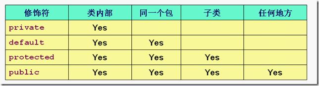
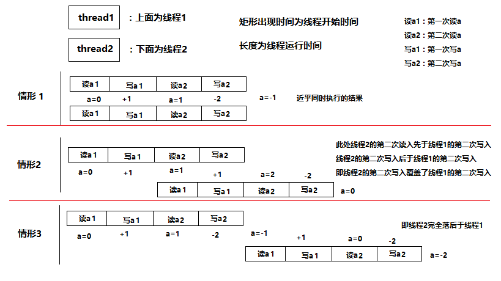
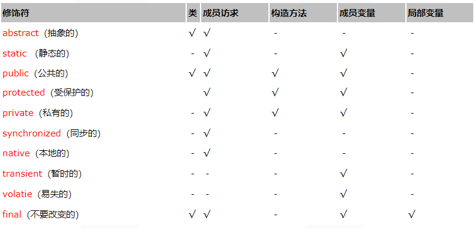
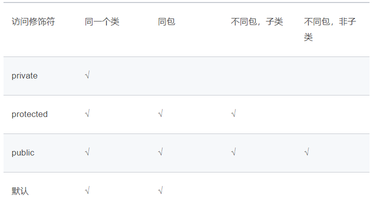

**下列说法哪个正确(    )**

A、不需要定义类，就能创建对象

B、对象中必须有数据域和方法

C、数据域可以是基本类型变量，也可以是一个对象

D、数据域必须是基本类型变量

**选C**

A、在Java中数据域和方法都必须属于某一个对象。不能单独存在，没有C++中的全局变量和方法一说。对象必须属于某一个类。

B、对象中可以什么也没有

D、数据域可以是基本数据类型，也可以是引用类型。

---

**对于非运行时异常，程序中一般可不做处理，由java虚拟机自动进行处理。**

A、正确

B、错误

**选B**

运行异常，可以通过java虚拟机来自行处理。非运行异常，我们应该捕获或者抛出

---

**以下哪个事件会导致线程销毁？（）**

A、调用方法sleep()

B、调用方法wait()

C、start()方法的执行结束

D、run()方法的执行结束

**选D**


---

**try块后必须有catch块。（）**

A、正确

B、错误

**选B**

选B，catch可以省略，try的形式有三种： try-catch try-finally try-catch-finally 但catch和finally语句不能同时省略！

---

**关于访问权限，说法正确的是？ ( )**

A、类A和类B在同一包中，类B有个protected的方法testB，类A不是类B的子类（或子类的子类），类A可以访问类B的方法testB

B、类A和类B在同一包中，类B有个protected的方法testB，类A不是类B的子类（或子类的子类），类A不可以访问类B的方法testB

C、访问权限大小范围：public > 包权限 > protected > private

D、访问权限大小范围：public > 包权限 > private > protected

**选A**



---

**关于访问权限说法正确的是？(    )**

A、外部类定义前面可以修饰public,protected和private

B、局部内部类前面可以修饰public,protected和private

C、匿名内部类前面可以修饰public,protected和private

D、以上说法都不正确

**选D**

在Java中，可以将一个类定义在另一个类里面或者一个方法里边，这样的类称为内部类，广泛意义上的内部类一般包括四种：成员内部类，局部内部类，匿名内部类，静态内部类 。

1.成员内部类

（1）该类像是外部类的一个成员，可以无条件的访问外部类的所有成员属性和成员方法（包括private成员和静态成员）；

（2）成员内部类拥有与外部类同名的成员变量时，会发生隐藏现象，即默认情况下访问的是成员内部类中的成员。如果要访问外部类中的成员，需要以下形式访问：【外部类.this.成员变量 或 外部类.this.成员方法】；

（3）在外部类中如果要访问成员内部类的成员，必须先创建一个成员内部类的对象，再通过指向这个对象的引用来访问；

（4）成员内部类是依附外部类而存在的，也就是说，如果要创建成员内部类的对象，前提是必须存在一个外部类的对象；

（5）内部类可以拥有private访问权限、protected访问权限、public访问权限及包访问权限。如果成员内部类用private修饰，则只能在外部类的内部访问；如果用public修饰，则任何地方都能访问；如果用protected修饰，则只能在同一个包下或者继承外部类的情况下访问；如果是默认访问权限，则只能在同一个包下访问。外部类只能被public和包访问两种权限修饰。

2.局部内部类

（1）局部内部类是定义在一个方法或者一个作用域里面的类，它和成员内部类的区别在于局部内部类的访问仅限于方法内或者该作用域内；

（2）局部内部类就像是方法里面的一个局部变量一样，是不能有public、protected、private以及static修饰符的。

3.匿名内部类

（1）一般使用匿名内部类的方法来编写事件监听代码；

（2）匿名内部类是不能有访问修饰符和static修饰符的；

（3）匿名内部类是唯一一种没有构造器的类；

（4）匿名内部类用于继承其他类或是实现接口，并不需要增加额外的方法，只是对继承方法的实现或是重写。

4.内部静态类

（1）静态内部类是不需要依赖于外部类的，这点和类的静态成员属性有点类似；

（2）不能使用外部类的非static成员变量或者方法。

---

**一个容器类数据结构，读写平均，使用锁机制保证线程安全。如果要综合提高该数据结构的访问性能，最好的办法是______。**

A、只对写操作加锁，不对读操作加锁

B、读操作不加锁，采用copyOnWrite的方式实现写操作

C、分区段加锁

D、无法做到

**选C**

A，只对写操作加锁，不对读操作加锁，会造成读到脏数据

B，CopyOnWrite的核心思想是利用高并发往往是读多写少的特性，对读操作不加锁，对写操作，先复制一份新的集合，在新的集合上面修改，然后将新集合赋值给旧的引用。这里读写平均，不适用

C，分段加锁，只在影响读写的地方加锁，锁可以用读写锁，可以提高效率

---

**假设 a 是一个由线程 1 和线程 2 共享的初始值为 0 的全局变量，则线程 1 和线程 2 同时执行下面的代码，最终 a 的结果不可能是（）**

```java
class Test {
    public static void main(String[] args) {
        boolean isOdd = false;
        for (int i = 1; i <= 2; ++i) {
            if (i % 2 == 1) isOdd = true;
            else isOdd = false;
            a += i * (isOdd ? 1 : -1);
        }
    }
}
```

A、-1

B、-2

C、0

D、1

**选D**

易知：每个线程对a 均做了两次读写操作，分别是 “ +1 ” 和 “ -2 ”
而题目问了是最终a 的结果，所以 a 的结果取决于各自线程对 a 的先后读写的顺序
结论：a的可能取值为-1、0、-2 如图：



---

**servlet周期包含哪些：**

A、初始化

B、销毁

C、请求处理

D、开始

**选ABC**

Servlet生命周期分成3个阶段：

1）初始化阶段：调用init方法

2）响应客户请求：调用service

3）终止：调用destory方法

初始化阶段：在下列时刻servlet容器装载servlet

1 servlet容器启动时，自动装载某些servlet

2 在servlet容器启动后，客户首次向servlet发送请求

3 servlet类文件被更新之后，重新装载servlet

Servlet被装载之后，servlet容器创建一个servlet'对象并调用servlet的init方法，在servlet生命周期内，init方法只能被调用一次。servlet工作原理：客户端发起一个请求，servlet调用service方法时请求进行响应，service对请求的方式进行了匹配，选择调用dopost或者doget等这些方法，然后进入对应方法中调用逻辑层的方法，实现对客户的响应。

响应客户请求：对于用户到达servlet的请求，servlet容器会创建特定于该请求的servletrequest和servletresponse对象，然后调用servlet的service方法，service方法从servletrequest对象中获取客户请求的信息，处理该请求，并且通过servletresponse对象向客户端返回响应信息。

终止：当web应用终止或者servlet容器终止或servlet容器重新装载servlet新实例时，servlet容器会调用servlet对象的destory方法，在destory方法中可以释放servlet占用的资源

---

**不能用来修饰interface的有（ ）（仅限外部接口）**

A、private

B、public

C、protected

D、static

**选ACD**

1、抽象类中的抽象方法（其前有abstract修饰）不能用private、static、synchronized、native访问修饰符修饰。原因如下：抽象方法没有方法体，是用来被继承的，所以不能用private修饰；static修饰的方法可以通过类名来访问该方法（即该方法的方法体），抽象方法用static修饰没有意义；使用synchronized关键字是为该方法加一个锁。。而如果该关键字修饰的方法是static方法。则使用的锁就是class变量的锁。如果是修饰类方法。则用this变量锁。但是抽象类不能实例化对象，因为该方法不是在该抽象类中实现的。是在其子类实现的。所以。锁应该归其子类所有。所以。抽象方法也就不能用synchronized关键字修饰了；native，这个东西本身就和abstract冲突，他们都是方法的声明，只是一个吧方法实现移交给子类，另一个是移交给本地操作系统。如果同时出现，就相当于即把实现移交给子类，又把实现移交给本地操作系统，那到底谁来实现具体方法呢？

2、接口是一种特殊的抽象类，接口中的方法全部是抽象方法（但其前的abstract可以省略），所以抽象类中的抽象方法不能用的访问修饰符这里也不能用。而且protected访问修饰符也不能使用，因为接口可以让所有的类去实现（非继承），不只是其子类，但是要用public去修饰。接口可以去继承一个已有的接口。

题考察修饰符，函数定义等，故从网上搜罗了下相关资料，总结如下：

类、方法、成员变量和局部变量的可用修饰符



类的修饰符整合

一．类

类的修饰符：

Public:可以在其他任何类中使用，默认为统一包下的任意类。

Abstract:抽象类，不能被实例化，可以包含抽象方法，抽象方法没有被实现，无具体功能，只能衍生子类。

Final:不能被继承。

二．变量

变量修饰符：

一个类的成员变量的声明必须在类体中，而不能在方法中，方法中声明的是局部变量。

1.       可访问修饰符： 
2.       static：类变量：一个类所拥有的变量，不是类的每个实例有的变量。类变量是指不管类创建了多少对象，系统仅在第一次调用类的时候为类变量分配内存，所有对象共享该类的类变量，因此可以通过类本身或者某个对象来访问类变量。 
3.       final：常量。 
4.       volatile：声明一个可能同时被并存运行的几个线程所控制和修改的变量。 

实例变量：和类变量对应，即每个对象都拥有各自独立的实例变量。

三．方法：（和变量对象分为实例方法和类方法，并用有无static修饰区别）

类方法：使用static关键字说明的方法

1.第一次调用含类方法的类是，系统只为该类创建一个版本，这个版本被该类和该类的所有实例共享。

2.类方法只能操作类变量，不能访问实例变量。类方法可以在类中被调用，不必创建实例来调用，当然也可以通过对象来调用。

实例方法：实例方法可以对当前对象的实例变量操作，而且可以访问类变量。

方法可以重载，要求：方法名相同，但是参数必须有区别。（参数不同可以使类型不同，顺序不同，个数不同）

方法的返回类型：若无返回类型，则声明为void.

方法中的变量作用域：

1.       成员变量：整个类。 
2.       局部变量：定义起到方法块结束为止。 
3.       方法参数：整个方法或者构造方法。 
4.       异常处理参数：参数传递给异常处理方法。 

构造方法：和类同名的方法。为新建对象开辟内存空间后，用于初始化新建的对象。不能用对象显式的调用。

静态初始化器：格式：static{<赋值语句组>}

静态初始化器与构造方法的区别：


方法的修饰符：

抽象方法：用abstract修饰，只有声明部分，方法体为空，具体在子类中完成。

类方法：静态方法，用static修饰，

1.       调用时，使用类名作为前缀，而不是类的某个实例对象名 
2.       不能被单独对象拥有，属于整个类共享。 
3.       不能处理成员变量。 

最终方法：用final修饰，不能被子类重新定义的方法。

本地方法：用native修饰的方法，表示用其他语言书写的特殊方法，包括C，C++，FORTRAN，汇编语言等。

四．类成员的访问控制符：

即类的方法和成员变量的访问控制符，一个类作为整体对象不可见，并不代表他的所有域和方法也对程序其他部分不可见，需要有他们的访问修饰符判断。

权限如下：



---

**以下哪些类是线程安全的（）**

A、Vector

B、HashMap

C、ArrayList

D、StringBuffer

E、Properties

**选ADE**

A，Vector相当于一个线程安全的List

B，HashMap是非线程安全的，其对应的线程安全类是HashTable

C，Arraylist是非线程安全的，其对应的线程安全类是Vector

D，StringBuffer是线程安全的，相当于一个线程安全的StringBuilder

E，Properties实现了Map接口，是线程安全的
