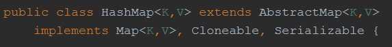
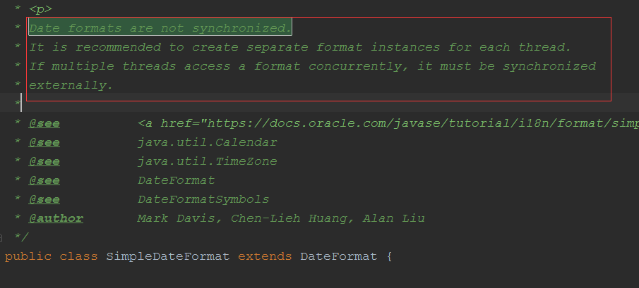

**下列代码的执行结果是：（ ）**

```java
public class Test3 {
    public static void main(String args[]) {
        System.out.println(100 % 3);
        System.out.println(100 % 3.0);
    }
}
```

A、1和1

B、1和1.0

C、1.0和1

D、1.0和1.0

**选B**

100对3取余，两者都是int型，所以结果也是int型，也就是1
100对3.0取余，虚拟机会对100进行转换，转换成100.0，也就是float型，结果也就是float型，也就是1.0

---

**下列哪个说法是正确的（）**

A、ConcurrentHashMap使用synchronized关键字保证线程安全

B、HashMap实现了Collection接口

C、Array.asList方法返回java.util.ArrayList对象

D、SimpleDateFormat是线程不安全的

**选A、D**

A. JDK1.8 的 ConcurrentHashMap 采用CAS+Synchronized保证线程安全。 JDK1.7
及以前采用segment的分段锁机制实现线程安全，其中segment继承自ReentrantLock，因此采用Lock锁来保证线程安全。

B.


C. Arrays.asList()  返回 java.util.Arrays.ArrayList 对象，这里的 ArrayList 是 Arrays 私有的内部类

D.


---

**以下哪项不属于java类加载过程？**

A、生成java.lang.Class对象

B、int类型对象成员变量赋予默认值

C、执行static块代码

D、类方法解析

**选B**

不应该选D，而应该选B

类的加载包括：加载，验证，准备，解析，初始化。

选项A：生成java.lang.Class对象是在加载时进行的。生成Class对象作为方法区这个类的各种数据的访问入口。

选项B：既然是对象成员，那么肯定在实例化对象后才有。在类加载的时候会赋予初值的是类变量，而非对象成员。

选项C：这个会调用。可以用反射试验。

选项D：类方法解析发生在解析过程。

---

**下面这条语句一共创建了多少个对象：String s="welcome"+"to"+360;**

A、1

B、2

C、3

D、4

选A

是否大家有没有刷到这类面试题：在执行String s = "Hello";s = s + " world!";这两行代码后，原始的String对象中的内容到底变了没有？

答案的解析：

没有。因为String被设计成不可变(immutable)类，所以它的所有对象都是不可变对象。在这段代码中，s原先指向一个String对象，内容是 "Hello"
，然后我们对s进行了+操作，那么s所指向的那个对象是否发生了改变呢？答案是没有。这时，s不指向原来那个对象了，而指向了另一个 String对象，内容为"Hello world!"
，原来那个对象还存在于内存之中，只是s这个引用变量不再指向它了。    
通过上面的说明，我们很容易导出另一个结论，如果经常对字符串进行各种各样的修改，或者说，不可预见的修改，那么使用String来代表字符串的话会引起很大的内存开销。因为
String对象建立之后不能再改变，所以对于每一个不同的字符串，都需要一个String对象来表示。这时，应该考虑使用StringBuffer类，它允许修改，而不是每个不同的字符串都要生成一个新的对象。并且，这两种类的对象转换十分容易。
同时，我们还可以知道，如果要使用内容相同的字符串，不必每次都new一个String。例如我们要在构造器中对一个名叫s的String引用变量进行初始化，把它设置为初始值，应当这样做： public class Demo { private
String s; ... public Demo { s = "Initial Value"; } ... } 而非 s = new String("Initial Value");    
后者每次都会调用构造器，生成新对象，性能低下且内存开销大，并且没有意义，因为String对象不可改变，所以对于内容相同的字符串，只要一个String对象来表示就可以了。也就说，多次调用上面的构造器创建多个对象，他们的String类型属性s都指向同一个对象。    
上面的结论还基于这样一个事实：对于字符串常量，如果内容相同，Java认为它们代表同一个String对象。而用关键字new调用构造器，总是会创建一个新的对象，无论内容是否相同。
至于为什么要把String类设计成不可变类，是它的用途决定的。其实不只String，很多Java标准类库中的类都是不可变的。在开发一个系统的时候，我们有时候也需要设计不可变类，来传递一组相关的值，这也是面向对象思想的体现。不可变类有一些优点，比如因为它的对象是只读的，所以多线程并发访问也不会有任何问题。当然也有一些缺点，比如每个不同的状态都要一个对象来代表，可能会造成性能上的问题。所以Java标准类库还提供了一个可变版本，即
StringBuffer。

说说我的看法：字面量的创建是发生在编译期，类似于上述面试题，答案只创建一个对象。

---

**下面代码输出结果是？**

```java
class Test {
    public static void main(String[] args) {
        int i = 5;
        int j = 10;
        System.out.println(i + ~j);
    }
}
```

A、Compilation error because”~”doesn’t operate on integers

B、-5

C、-6

D、15

**选C**

公式-n=~n+1可推出~n=-n-1，所以~10=-11再加5结果为-6

---

**在java中，下列对继承的说法，正确的是（ ）**

A、子类能继承父类的所有成员

B、子类继承父类的非私有方法和状态

C、子类只能继承父类的public方法和状态

D、子类只能继承父类的方法

**选A**

使用反射可以看出子类是继承了父类的私有方法的(不管是否是final)，只是直接调用父类的私有方法是不可以的，但是利用反射的方式可以调用。字段同理。
