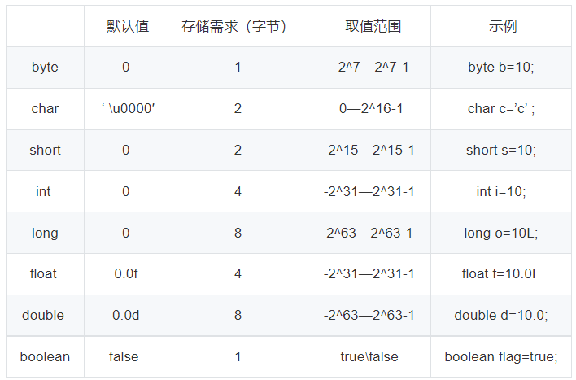

# 2022-12-13

---

**下列说法正确的是**

A、在类方法中可用this来调用本类的类方法

B、在类方法中调用本类的类方法可直接调用

C、在类方法中只能调用本类的类方法

D、在类方法中绝对不能调用实例方法

**选B**

在类方法中调用本类的类方法可直接调用。 实例方法也叫做对象方法。
类方法是属于整个类的，而实例方法是属于类的某个对象的。
由于类方法是属于整个类的，并不属于类的哪个对象，所以类方法的方法体中不能有与类的对象有关的内容。即类方法体有如下限制：

(1) 类方法中不能引用对象变量；

(2) 类方法中不能调用类的对象方法；

(3) 在类方法中不能使用super、this关键字。

(4)类方法不能被覆盖。

如果违反这些限制，就会导致程序编译错误。
与类方法相比，对象方法几乎没有什么限制：

(1) 对象方法中可以引用对象变量，也可以引用类变量；

(2) 对象方法中可以调用类方法；

(3) 对象方法中可以使用super、this关键字。

---

**下面有关java基本类型的默认值和取值范围，说法错误的是？**

A、字节型的类型默认值是0，取值范围是-2^7—2^7-1

B、boolean类型默认值是false，取值范围是true\false

C、字符型类型默认是0，取值范围是-2^15 —2^15-1

D、long类型默认是0，取值范围是-2^63—2^63-1

**选C**

---

**下面哪种情况会导致持久区jvm堆内存溢出？**

A、循环上万次的字符串处理

B、在一段代码内申请上百M甚至上G的内存

C、使用CGLib技术直接操作字节码运行，生成大量的动态类

D、不断创建对象

**选C**

Java中堆内存分为两部分，分别是permantspace和heap
space。permantspace（持久区）主要存放的是Java类定义信息，与垃圾收集器要收集的Java对象关系不大。持久代溢出通常由于持久代设置过小，动态加载了大量Java类，因此C选项正确。
heap space分为年轻代和年老代， 年老代常见的内存溢出原因有循环上万次的字符串处理、在一段代码内申请上百M甚至上G的内存和创建成千上万的对象，也就是题目中的ABD选项。

---

**Java的集合框架中重要的接口java.util.Collection定义了许多方法。选项中哪个方法是Collection接口所定义的（）**

A、int size()

B、boolean containsAll(Collection c)

C、compareTo(Object obj)

D、boolean remove(Object obj)

**选ABD**

Collection 接口常用的方法

* size():返回集合中元素的个数
* add(Object obj):向集合中添加一个元素
* addAll(Colletion coll):将形参coll包含的所有元素添加到当前集合中
* isEmpty():判断这个集合是否为空
* clear():清空集合元素
* contains(Object obj):判断集合中是否包含指定的obj元素
* ① 判断的依据：根据元素所在类的equals()方法进行判断
* ②明确：如果存入集合中的元素是自定义的类对象，要去：自定义类要重写equals()方法
* constainsAll(Collection coll):判断当前集合中是否包含coll的所有元素
* rentainAll(Collection coll):求当前集合与coll的共有集合，返回给当前集合
* remove(Object obj):删除集合中obj元素，若删除成功，返回ture否则
* removeAll(Collection coll):从当前集合中删除包含coll的元素
* equals(Object obj):判断集合中的所有元素 是否相同
* hashCode():返回集合的哈希值
* toArray(T[] a):将集合转化为数组
* ①如有参数，返回数组的运行时类型与指定数组的运行时类型相同。
* iterator():返回一个Iterator接口实现类的对象,进而实现集合的遍历。
* 数组转换为集合：Arrays.asList(数组)

---

**下列哪些情况下会导致线程中断或停止运行（）**

A、抛出InterruptedException异常

B、线程调用了wait方法

C、当前线程创建了一个新的线程

D、高优先级线程进入就绪状态

**选B**

A 选项：Interrupt 确实会导致线程中断，但是既然捕获到异常就代表线程不会中断和停止

B 选项：线程调用 wait（）方法，释放了锁，会强制导致当前正在执行的线程中断，需要 notify（）或 notifyall（）来“唤醒“

C 选项：当线程创建一个新的线程时，CPU 时间片不会剥夺当前线程运行的“权利”

D 选项：当高优先级线程进入就绪状态，也需要等待当前线程的运行结束才可以继续运行，此时当前线程处于运行中 RUBBABLE 状态中的 READY 就绪态

---

**下列描述正确的是（ ）？**

A、类不可以多继承而接口可以多实现

B、抽象类自身可以定义成员而接口不可以

C、抽象类和接口都不能被实例化

D、一个类可以有多个直接基类和多个基接口

**选AC**

1.java支持单继承，却可以实现多个接口。a对d错

2.接口没有构造方法，所以不能实例化，抽象类有构造方法，但是不是用来实例化的，是用来初始化的。c对

3.抽象类可以定义普通成员变量而接口不可以，但是抽象类和接口都可以定义静态成员变量，只是接口的静态成员变量要用static final public 来修饰。b错
