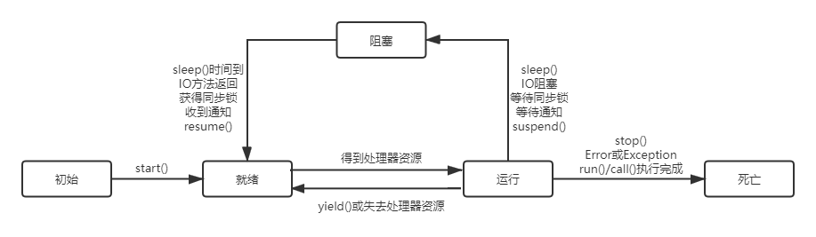

**我们在程序中经常使用“System.out.println()”来输出信息，语句中的System是包名，out是类名，println是方法名。**
A、对
B、错

**选B**
System是java.lang中的一个类，out是System内的一个成员变量，这个变量是一个java.io.PrintStream类的对象，println呢就是一个方法了。

---

```java
public interface IService {
    String NAME = "default";
}
```

**默认类型等价表示是哪一项:**
A、public String NAME="default";
B、public static String NAME="default";
C、public static final String NAME="default";
D、private String NAME="default";

**选C**
接口中的变量默认是public static final 的，方法默认是public abstract 的

---

**在jdk1.5之后，下列 java 程序输出结果为______。**
A、true,false
B、true,true
C、false,true
D、false,false
E、对于不同的环境结果不同
F、程序无法执行

**选B**
本题是一个自动拆装箱的考题(自动拆装箱JDK需在1.5上），下面的讨论都不针对新开辟对象的情况：
1、基本型和基本型封装型进行“==”运算符的比较，基本型封装型将会自动拆箱变为基本型后再进行比较，因此Integer(0)会自动拆箱为int类型再进行比较，显然返回true；
2、两个Integer类型进行“==”比较，如果其值在-128至127，那么返回true，否则返回false, 这跟Integer.valueOf()的缓冲对象有关，这里不进行赘述。
3、两个基本型的封装型进行equals()比较，首先equals()会比较类型，如果类型相同，则继续比较值，如果值也相同，返回true
4、基本型封装类型调用equals(),但是参数是基本类型，这时候，先会进行自动装箱，基本型转换为其封装类型，再进行3中的比较。

```java
class Test {
    public static void main(String[] args) {
        int a = 257;
        Integer b = 257;
        Integer c = 257;
        Integer b2 = 57;
        Integer c2 = 57;
        System.out.println(a == b);
        //System.out.println(a.equals(b));编译出错，基本型不能调用equals() 
        System.out.println(b.equals(257.0));
        System.out.println(b == c);
        System.out.println(b2 == c2);
    }
}
```

因此上面的代码的结果因此为 true, false, false, true

---

**Test.main()函数执行后的输出是（ ）**

```java
class Test {
    public static void main(String[] args) {
        System.out.println(new B().getValue());
    }

    static class A {
        protected int value;

        public A(int v) {
            setValue(v);
        }

        public void setValue(int value) {
            this.value = value;
        }

        public int getValue() {
            try {
                value++;
                return value;
            } finally {
                this.setValue(value);
                System.out.println(value);
            }
        }
    }

    static class B extends A {
        public B() {
            super(5);
            setValue(getValue() - 3);
        }

        public void setValue(int value) {
            super.setValue(2 * value);
        }
    }
}
```

A、6 7 7
B、22 34 17
C、22 74 74
D、11 17 34

**选B**
本题较为复杂，具体思路如下：
第一个数值

1. new B()构造B类实例对象，进入B类的构造方法，B类构造方法的第一行代码用super(5)调用了父类带有参数的构造函数，父类的构造函数又调用了setValue()
   方法，但值得注意的是，子类中的方法覆盖父类的方法以后，由于向上转型，父类调用的方法实际上是子类的。那么这里的setValue(v);调用了B类的setValue()方法，而B类中setValue()
   方法又使用super关键字调用了父类的setValue()方法，将B实例的value值设置为2 x 5 = 10。那么到这里，B类的构造函数中第一行代码super(5)执行完毕，程序继续向下执行进入setValue(
   getValue()- 3);代码块。
2. 这里先执行getValue()方法，但因为B类中并没有重写该方法，这里需要调用父类的getValue()方法。进入A类getValue()方法，首先是value++，那么此时B的成员变量value值由
   10变为11，程序继续向下执行，将11作为返回值，但此处要注意的一点是，在Try catch
   finally体系当中，在return之前始终会执行finally里面的代码，如果finally里面有return，则数据跟随finally改变。如果没有return，则原数据不跟随finally里改变的数据改变。那么进入finally代码块，由于此时正在初始化的是B类的一个对象（运行时多态），因此调用B类的setValue()
   方法。B类的setValue()方法中使用super关键字调用了父类的setValue()方法，将原有的value*2，即11 x 2 = 22，继续向下进行System.out.println(value)
   ;输出第一个数值22。随后，A类的getValue()方法将之前暂存的value=11返回。
   第二个数值
3. 拿到getValue()方法返回值之后程序继续运行，此处代码变为setValue(11- 3);根据和之前相同的流程，B类成员变量value的值变为16。程序运行到此处，new B()执行完毕。
4. 回到main函数中，实例化的B类对象调用getValue()方法，B类中并没有重写该方法，需要调用父类的getValue()方法。getValue()
   方法第一行代码value++将B的成员变量value值变为17，此时执行到return代码，将value=17暂存，等待finally代码块运行完毕后返回。
5. 此处finally代码块执行流程和之前相同，这里不再赘述。那么执行完this.setValue(value);后，value值变为2 x 17 = 34。继续向下进行System.out.println(value)
   ;输出第二个数值34，return刚刚暂存的value=17。
   第三个数值
   回到main函数，将刚刚返回的值输出，就得到了第三个数值17。
   综上所述，本题正确答案为B。

---

**关于Java以下描述正确的有()**
A、Class类是Object类的超类
B、Object类是一个final类
C、String类是一个final类
D、Class类可以装载其它类

**选CD**
Obejct是是Java.lang包下对应类的超类；
首先被final修饰的类是最终类，没有子类的，其次Object是clas的父类；
String 是不可变的，String类中使用的是final 关键字修饰的字符数组来保存字符串的，private final char value []

---

**在Java线程状态转换时，下列转换不可能发生的有（）？**

A、初始态->运行态
B、就绪态->运行态
C、阻塞态->运行态
D、运行态->就绪态

**选AC**
线程的生命周期中包含五种状态：初始态、就绪态、运行态、阻塞态、死亡状态。
其状态转换如下图所示：



根据图片可知B、D选项正确，A、C选项错误。

---

**多态的作用（）**
A、隐藏细节
B、提高可重用性
C、扩展代码模块
D、提高编译可靠性

**选BC**

---

**关于Java中的数组，下面的一些描述，哪些描述是准确的：（ ）**
A、数组是一个对象，不同类型的数组具有不同的类
B、数组长度是可以动态调整的
C、数组是一个连续的存储结构
D、一个固定长度的数组可类似这样定义: int array[100]
E、两个数组用equals方法比较时，会逐个遍历其中的元素，对每个元素进行比较
F、可以二维数组，且可以有多维数组，都是在Java中合法的

**选ACF**
官方解析：当数组的初始化完成后数组在内存中所占用的空间将会被固定，即使我们清空这个数组中的元素，它所占用的空间依然会被保留。这造成了Java数组长度的不可变，选项B错误。Java语言中，数组是一种引用类型的变量，使用它定义变量时，这个引用变量还没有指向任何有效的内存空间，因此定义数组时不能指定数组的长度。而由于这个引用变量并没有指向任何有效的内存空间，所以没有空间来存储任何元素，只有当对数组初始化后，才可以使用这个数组。D选项正确的定义方式为int[]
array =new int[100]。本题易错点是E选项，数组是一种引用数据类型，继承自Object类的，所以其中也包含了未被重写的equals()方法，所有的引用变量都能调用equals()
方法来判断他是否与其他引用变量相等，使用这个方法来判断两个引用对象是否相等的判断标准与使用==运算符没有区别，只有在两个引用变量指向同一个对象才会返回true。如果想达到E选项描述的效果，需要使用Arrays.equals()方法。

---

**下面哪个语句是创建数组的正确语句？( )**
A、float f[][] = new float[6][6];
B、float []f[] = new float[6][6];
C、float f[][] = new float[][6];
D、float [][]f = new float[6][6];
E、float [][]f = new float[6][];

**选ABDE**
