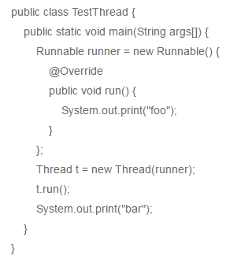

# 2022-12-16

---

**接口不能扩展（继承）多个接口。（ ）**

A、正确

B、错误

**选B**

接口可以实现多继承

---

**以下程序的运行结果是？**

A、foobar

B、barfoo

C、foobar或者barfoo都有可能

D、Bar

E、Foo

F、程序无法正常运行

**选A**

答案是 A foobar

这道题是考线程的调用情况，线程的启动方式只能通过start这种方式启动才能真正的实现多线程的效果，如果是手动调用run方法和普通方法调用没有区别，所以这个还是按照顺序执行首先执行run方法之后，执行输出语句所以最终得到结果foobar.

---

**如果一个接口Cup有个方法use()，有个类SmallCup实现接口Cup，则在类SmallCup中正确的是？  ( )**

A、void use() { …}

B、protected void use() { …}

C、public void use() { …}

D、以上语句都可以用在类SmallCup中

**选C**

既然是实现接口，就要实现接口的所以方法，相当于重写方法，方法的重写需要满足：三同一大一小（方法名、返回值类型、形参相同；访问权限>=重写前；抛出异常<=重写前）

---

**下列关于JAVA多线程的叙述正确的是（）**

A、调用start()方法和run()都可以启动一个线程

B、CyclicBarrier和CountDownLatch都可以让一组线程等待其他线程

C、Callable类的call()方法可以返回值和抛出异常

D、新建的线程调用start()方法就能立即进行运行状态

**选BC**

A，start是开启线程，run是线程的执行体，run是线程执行的入口。

B，CyclicBarrier和CountDownLatch都可以让一组线程等待其他线程。前者是让一组线程相互等待到某一个状态再执行。后者是一个线程等待其他线程结束再执行。

C，Callable中的call比Runnable中的run厉害就厉害在有返回值和可以抛出异常。同时这个返回值和线程池一起用的时候可以返回一个异步对象Future。

D，start是把线程从new变成了runnable

---

**以下关于对象序列化描述正确的是**

A、使用FileOutputStream可以将对象进行传输

B、使用PrintWriter可以将对象进行传输

C、使用transient修饰的变量不会被序列化

D、对象序列化的所属类需要实现Serializable接口

**选CD**

使用ObjectOutputStream和ObjectInputStream可以将对象进行传输.

声明为static和transient类型的成员数据不能被串行化。因为static代表类的状态， transient代表对象的临时数据。

---

**以下说法中正确的有？**

A、StringBuilder是 线程不安全的

B、Java类可以同时用 abstract和final声明

C、HashMap中，使用 get(key)==null可以 判断这个Hasmap是否包含这个key

D、volatile关键字不保证对变量操作的原子性

**选AD**

A.StringBuilder线程不安全，StringBuffer线程安全。

B.同时用 abstract和final就会自相矛盾。

C.Hashmap中的value可以之null，get(key)==null有两种情况，一是key不存在，二是该key中存的是null，所以应该使用map.containskey(key)返回的true/false来判断是否存在这个key。

D.volatile关键字有两个作用：

1.并发环境可见性：volatile修饰后的变量能够保证该变量在线程间的可见性，线程进行数据的读写操作时将绕开工作内存（CPU缓存）而直接跟主内存进行数据交互，即线程进行读操作时直接从主内存中读取，写操作时直接将修改后端变量刷新到主内存中，这样就能保证其他线程访问到的数据是最新数据

2.并发环境有序性：通过对volatile变量采取内存屏障（Memory
barrier）的方式来防止编译重排序和CPU指令重排序，具体方式是通过在操作volatile变量的指令前后加入内存屏障，来实现happens-before关系，保证在多线程环境下的数据交互不会出现紊乱。

---

**以下哪些方法是Object类中的方法**

A、clone()

B、toString()

C、wait()

D、finalize()

**选ABCD**

全选，Object 类中方法及说明如下：

registerNatives()   //私有方法 getClass()    //返回此 Object 的运行类。

hashCode()    //用于获取对象的哈希值。

equals(Object obj)     //用于确认两个对象是否“相同”。

clone()    //创建并返回此对象的一个副本。

toString()   //返回该对象的字符串表示。

notify()    //唤醒在此对象监视器上等待的单个线程。

notifyAll()     //唤醒在此对象监视器上等待的所有线程。

wait(long timeout)    //在其他线程调用此对象的 notify() 方法或 notifyAll() 方法，或 者超过指定的时间量前，导致当前线程等待。

wait(long timeout, int nanos)    //在其他线程调用此对象的 notify() 方法或 notifyAll() 方法，或者其他某个线程中断当前线程，或者已超过某个实际时间量前，导致当前线程等待。

wait()    //用于让当前线程失去操作权限，当前线程进入等待序列

finalize()    //当垃圾回收器确定不存在对该对象的更多引用时，由对象的垃圾回收器调用此方法。

---

**往OuterClass类的代码段中插入内部类声明, 哪一个是错误的:**

A、class InnerClass{ public static float func(){return f;} }

B、abstract class InnerClass{ public abstract float func(){} }

C、static class InnerClass{ protected static float func(){return f;} }

D、public class InnerClass{ static float func(){return f;} }

**选ABCD**

主要考核了这几个知识点：

1.静态内部类才可以声明静态方法

2.静态方法不可以使用非静态变量

3.抽象方法不可以有函数体
